# Team10_BE


<p align="center">농산물로 지역을 잇는 플랫폼 “품앗이” 의 백엔드 서버입니다.</p>
<p align="center">
    <a href="https://www.kakaotechcampus.com/user/index.do" target="_blank">
        카카오 테크 캠퍼스 2기
    </a> 부산대 10조 프로젝트입니다.
</p>

## 📑 목차

- [📌 프로젝트 소개](#프로젝트-소개)
- [🛠️ 기술 스택](#기술-스택)
    - [Backend](#Backend)
    - [Build & Database](#Build-&-Database)
    - [Cloud & Deployment](#Cloud-&-Deployment)
- [📂 프로젝트 구조](#프로젝트-구조)
- [📄 API 명세서](#API-명세서)
- [📊 ERD](#ERD)
- [🚀 프로젝트 실행 방법](#프로젝트-실행-방법)
- [🌾 도메인 설명](#도메인-설명)
    - [농장 도메인](#농장-도메인)
    - [상품 도메인](#상품-도메인)
- [🔒 보안 설정](#보안-설정)
- [💳 결제 시스템 설정](#결제-시스템-설정)
- [🌃 이미지 관리(S3: PresignedUrl)](#이미지-관리s3-presignedurl)
- [🔄 지속적인 통합 및 배포](#지속적인-통합-및-배포)
    - [배포 개요](#배포-개요)
    - [배포 프로세스](#배포-프로세스)
    - [알림 및 모니터링](#알림-및-모니터링)
- [👥 Collaborators](#Collaborators)

## 📌 프로젝트 소개

품앗이는 농민과 소비자를 직접 연결하는 `온라인 직거래 플랫폼`입니다. 경매 법인의 독점과 과도한 유통비용으로 인한 기존 도매시장의 문제를 해결하고자, 농산물 유통 과정을 간소화하여 중소 농민들이 정당한 가격을 받을
수 있도록 지원합니다. 직관적인 UI와 신뢰성 높은 프로필 정보 제공을 통해, 소비자는 합리적인 가격에 고품질 농산물을 구매할 수 있습니다.

**기존 도매 유통 시장의 문제점**

    - 농산물의 가격이 농민에게 공정하지 않습니다.
    - 서울시 가락시장 도매 법인의 가락시장: 국내 농산물 유통량의 약 30%를 차지하는 중요한 역할
    - 가락시장과 같은 공영 도매시장의 경매법인은 일부 대기업에 의해 독과점화
    - 서울 가락시장에서 6개 도매법인이 90% 이상의 농산물 유통량을 차지

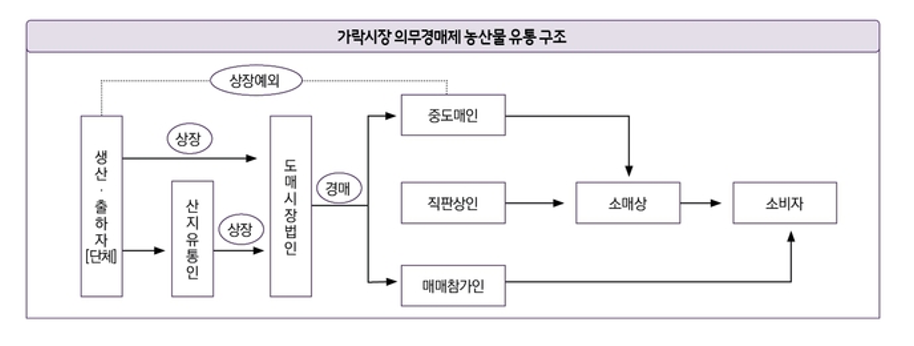

**도매 시장 문제로 인한 물가 변동 및 온라인 도매시장 도입 후 구조 변화**

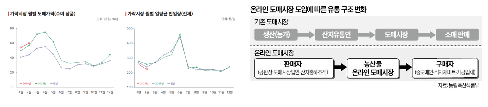

**품앗이의 목표**

    - 농산물 유통 과정을 간소화하여 농민과 소비자를 직접 연결
    - 농민이 직접 농산물을 판매할 수 있는 플랫폼 제공
    - 소비자가 농산물을 구매할 때 농민에게 공정한 가격을 지불

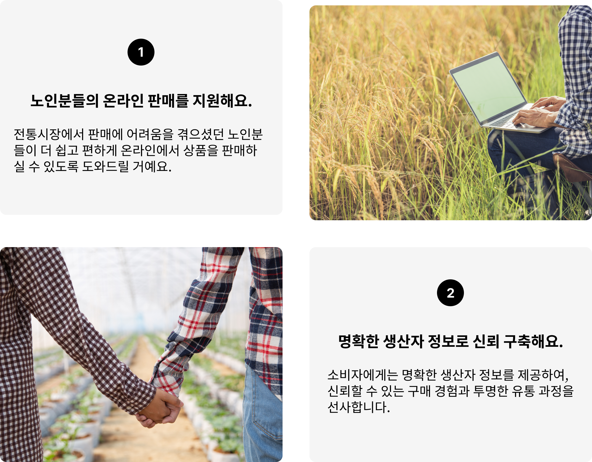

더 자세한 이야기는 [품앗이 소개 페이지]()로

## 🛠️ 기술 스택

<div align="center">

### Backend


### Build & Database


### Test


### Cloud & Deployment


### AI & OCR


</div>

<details>
<summary>버전 정보</summary>

- **Gradle JVM**: 22.0.2
- **Spring Boot**: 3.3.1
- **Java**: 21
- **MySQL**: 8.0

</details>

## 📂프로젝트 구성

```
.
├── build
│   ├── classes
│   ├── generated
│   ├── reports
│   └── resources
├── gradle
│   └── wrapper
└── src
    ├── main
    │   ├── java
    │   │   └── poomasi
    │   │       ├── Application.java
    │   │       ├── domain
    │   │       │   ├── auth
    │   │       │   │   ├── security
    │   │       │   │   │   ├── filter
    │   │       │   │   │   ├── handler
    │   │       │   │   │   └── oauth2
    │   │       │   │   ├── signup
    │   │       │   │   └── token
    │   │       │   ├── farm
    │   │       │   │   ├── _category
    │   │       │   │   └── _schedule
    │   │       │   ├── member
    │   │       │   │   ├── _biz
    │   │       │   │   └── _profile
    │   │       │   ├── order
    │   │       │   │   └── _aftersales
    │   │       │   ├── product
    │   │       │   │   ├── _cart
    │   │       │   │   ├── _category
    │   │       │   │   └── _intro
    │   │       │   ├── reservation
    │   │       │   ├── review
    │   │       │   │   ├── farm
    │   │       │   │   └── product
    │   │       │   └── wishlist
    │   │       ├── global
    │   │       │   ├── common
    │   │       │   ├── health
    │   │       │   ├── ocr
    │   │       │   └── util
    │   │       └── payment
    │   └── resources
    └── test
        ├── java
        │   └── poomasi
        │       ├── domain
        │       └── global
        └── resources
```

## 📄 API 명세서

[배포용 품앗이 명세서](https://bubble-pick-143.notion.site/1e48cc52884d4df993857a1e8f58ff26?pvs=4)

## 📊 ERD 요약

| 항목    | 설명               | ERD 이미지                         |
|-------|------------------|---------------------------------|
| 회원    | 회원의 기본 정보와 관계    | 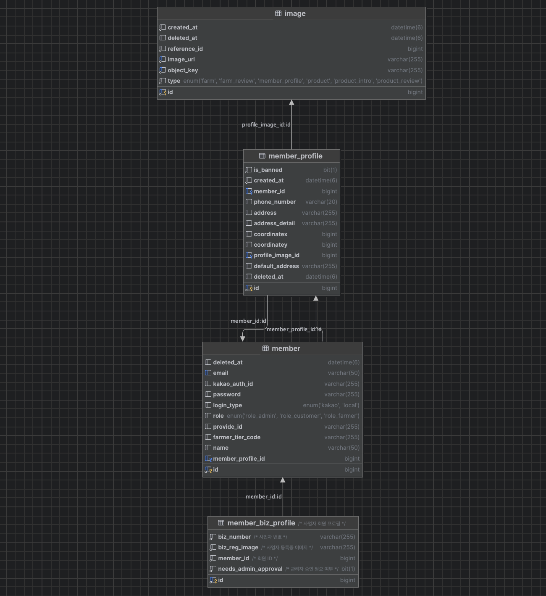  |
| 상품    | 상품 관련 정보와 카테고리   | 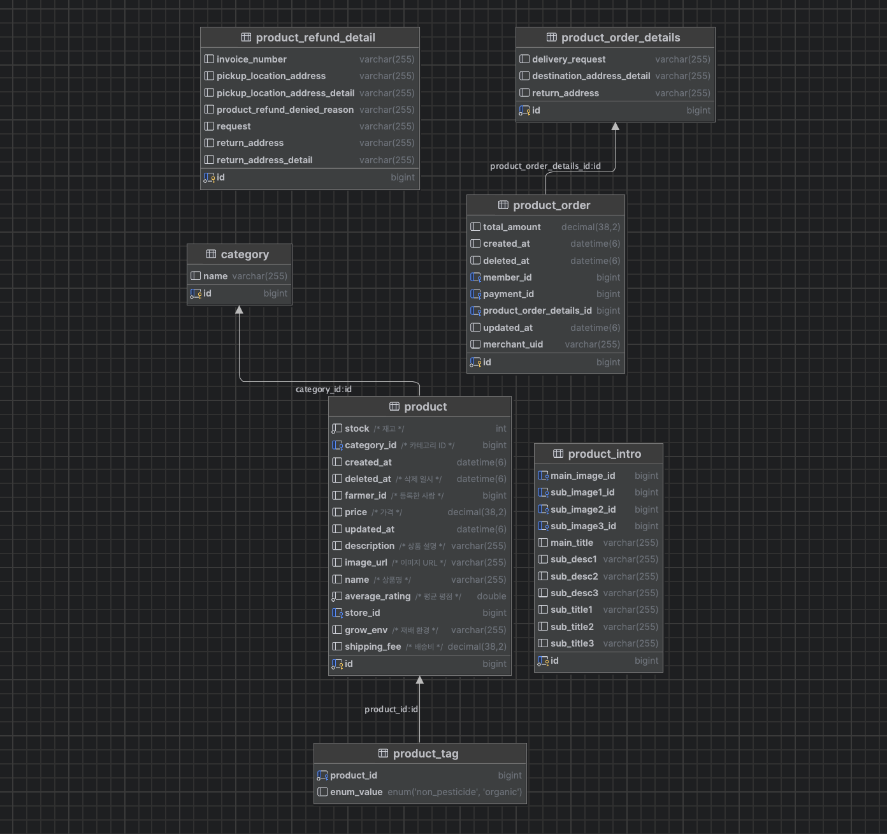 |
| 장바구니  | 상품과 사용자의 연관 관계   | 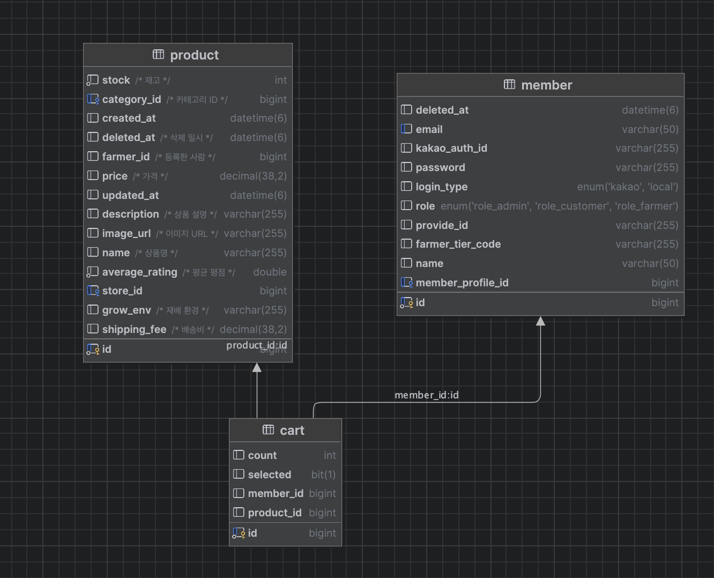      |
| 농장    | 농장 정보와 예약 시스템    | 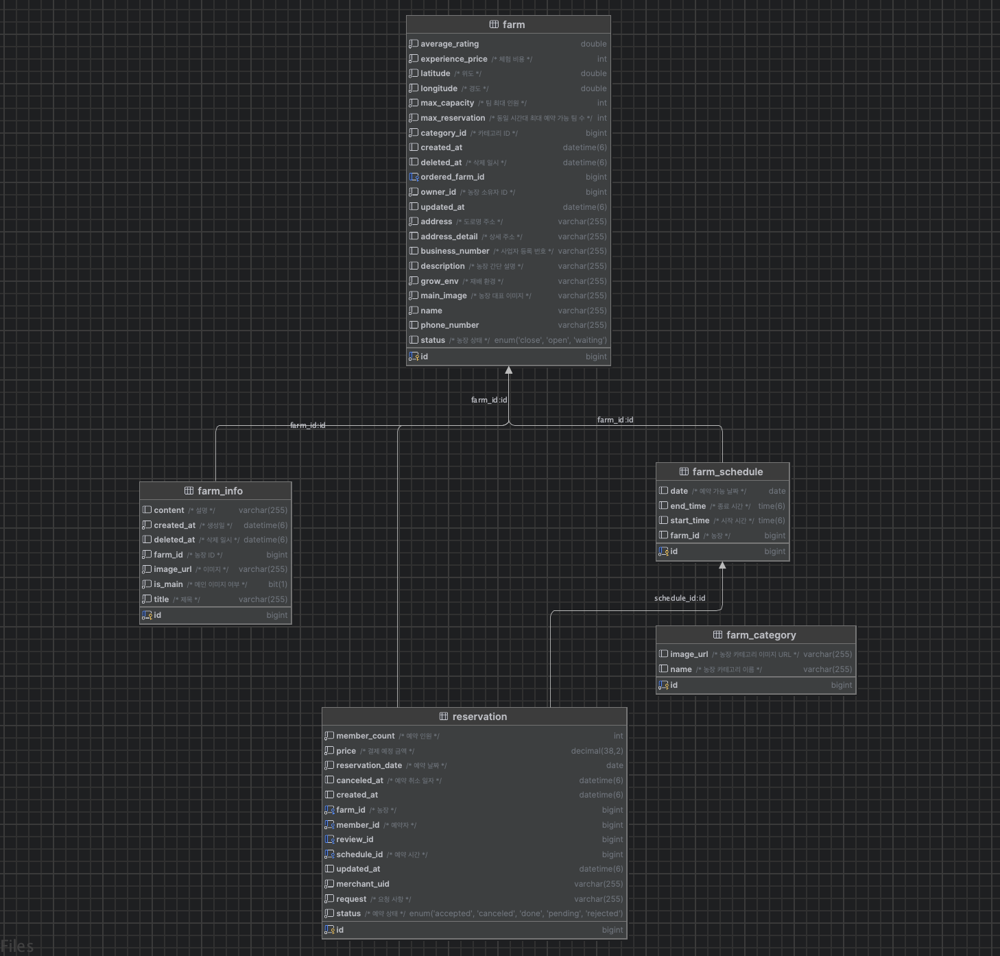    |
| 위시리스트 | 사용자의 관심 상품 저장 정보 | 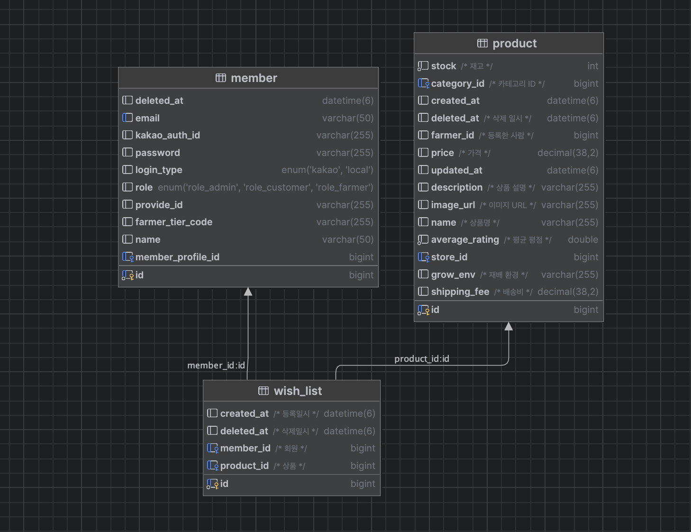 |

## 🚀 프로젝트 실행 방법

1. 프로젝트를 클론하고 디렉토리로 이동합니다.

```bash
git clone
cd Team10_BE
```

2. `application-secret.yml` 파일을 프로젝트 루트에 생성하고, 다음과 같은 내용을 추가합니다.

```yaml
spring:
  application:
    name: poomasi
  jpa:
    open-in-view: false
    hibernate:
      ddl-auto: update
    show-sql: true
    properties:
      hibernate:
        format_sql: true
        enable_lazy_load_no_trans: true
        hbm2ddl:
          jdbc_metadata_extraction_strategy: individually
  datasource:
    url: jdbc:mysql://localhost:3306/poomasi
    username: root
    password: <DB_PASSWORD>
    driver-class-name: com.mysql.cj.jdbc.Driver

  data:
    redis:
      port: 6379
      host: <REDIS_HOST>

  security:
    redirect_url: http://localhost:3000
    oauth2:
      client:
        registration:
          kakao:
            client-id: <KAKAO_CLIENT_ID>
            client-secret: <KAKAO_CLIENT_SECRET>
            scope: account_email, profile_nickname
            client-name: Kakao
            authorization-grant-type: authorization_code
            client-authentication-method: client_secret_post
            redirect-uri: http://localhost:8080/login/oauth2/code/kakao
        provider:
          kakao:
            authorization-uri: https://kauth.kakao.com/oauth/authorize
            token-uri: https://kauth.kakao.com/oauth/token
            user-info-uri: https://kapi.kakao.com/v2/user/me
            user-name-attribute: kakao_account

logging:
  level:
    org:
      springframework:
        web: DEBUG

jwt:
  secret: <JWT_SECRET>
  access-token-expiration-time: 3600000  # 1시간
  refresh-token-expiration-time: 604800000  # 7일

aws:
  s3:
    bucket: poomasi
    region: ap-northeast-2
  access: <AWS_ACCESS_KEY>
  secret: <AWS_SECRET_KEY>

imp:
  api:
    key: <IMP_API_KEY>
    secretKey: <IMP_SECRET_KEY>

naver:
  ocr:
    secret: <NAVER_OCR_SECRET>
    invoke: <NAVER_OCR_INVOKE_URL>
    template: <NAVER_OCR_TEMPLATE_ID>
```

3. application-secret.yml 파일을 저장한 후, 프로젝트를 실행합니다.

```
./gradlew bootRun
```

## 🌾 Feature

> 개발한 API들의 핵심 특성을 서술합니다.

### 상품 도메인

> 상품 도메인은 상품 정보를 관리하는 도메인입니다.

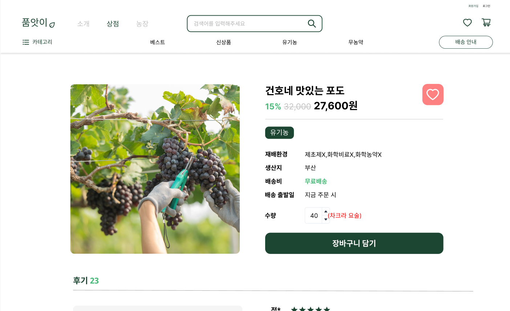

### 농장 도메인

> 농장 도메인은 농장 정보를 관리하는 도메인입니다.

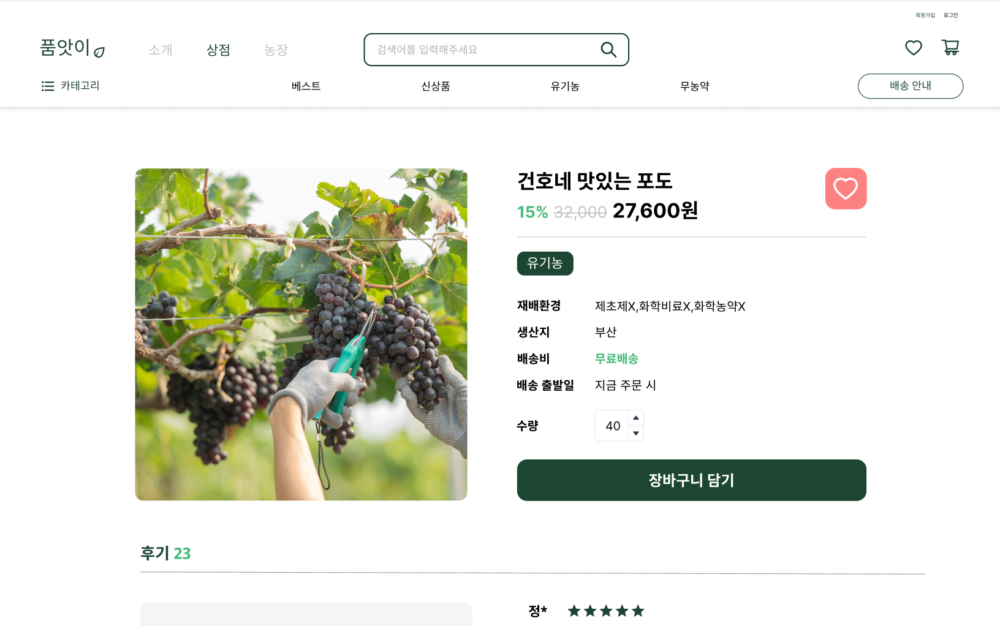

#### 1. 농장 사업자 등록

> 농장 사업자 등록은 농장을 등록하는 기능입니다.

#### 2. 농장 체험 예약

> 농장 체험 예약은 농장에서 진행하는 체험 프로그램을 예약하는 기능입니다.

농장 체험 예약은

#### 3. 농장 리뷰 조회

> 농장 리뷰 조회는 농장에 대한 리뷰를 조회하는 기능입니다.

## 🔒 Security 설정

## 💳 결제 시스템

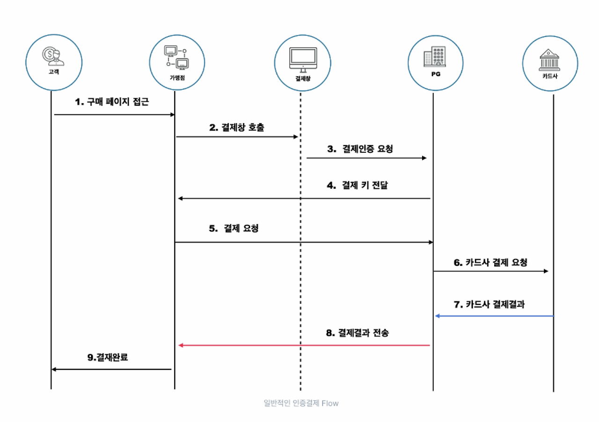

**결제 과정**

	1. 백엔드에서 결제 예정 금액을 계산해 PG 사에 결제 요청을 합니다. (재고확인 1회)
	2. 구매 페이지에서 결제 버튼을 누르면 백엔드에서 결제 요청을 합니다.
	3. 백엔드에서 결제 요청을 받아 결제 요청을 PG 사에 전달합니다.
	4. PG 사에서 결제 요청을 받아 카드사에 결제 요청을 합니다.
	5. 카드사에서 결제 결과를 PG 사에 전달합니다.
	6. PG 사에서 결제 결과를 받아 백엔드에 결제 결과를 전달합니다.
    7. 백엔드에서 결제 결과를 받아 결제 결과를 사용자에게 전달합니다. (재고확인 2회 & PG사에 요쳥해 결제 완료 확인 및 결제 완료 표시)

**환불 정첵**

    - 농장 체험일 3일 전에는 환불 수수료 50%를 부과합니다.
    - 상품 구매 후 환불 할 때 배송비 3,000원을 부과합니다.

## 🌃 이미지 관리 (S3: Presigned URL)

> `presigned url`을 사용하여 이미지를 관리합니다.


`presigned url`: 다른 사람(클라이언트)로 하여금 버킷에 객체를 업로드/조회할 수 있다. 해당 url을 사용할 경우 AWS 보안 자격 증명이나 권한이 없어도 접근 할 수 있다.

**이미지 업로드**

    1. Client 에서 presigned url을 백엔드 서버로 요청합니다.
    2. 백엔드 서버에서 S3에 이미지를 업로드할 수 있는 presigned url을 생성합니다.
    3. Client에서 생성된 presigned url을 사용하여 이미지를 업로드합니다.
    4. S3에 이미지가 업로드되면 백엔드 서버에 이미지 경로 값을 전달합니다.

- 백엔드 서버에서 이미지를 직접 업로드하면 서버의 부하가 증가합니다.
- presigned url을 사용하면 클라이언트에서 직접 이미지를 업로드할 수 있습니다.
- 따라서, 이미지 업로드 처리 속도가 빨라집니다.

## 🔄 지속적인 통합 및 배포

**배포 개요**

본 프로젝트는 GitHub Actions를 활용하여 ECS 및 EC2 환경에 자동으로 배포됩니다. Bridge 네트워크 모드로 Docker 컨테이너를 구성하여, ELB를 통해 외부 요청을 안정적으로 분산 처리할 수
있도록 설정되어 있습니다.

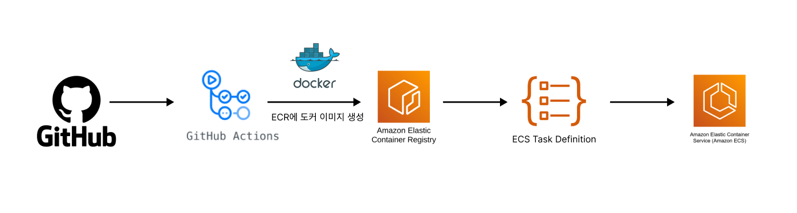

**배포 프로세스**

	1.	코드 변경 및 트리거: prod 브랜치에 코드가 푸시될 때마다 GitHub Actions가 자동으로 배포 프로세스를 시작합니다.
	2.	빌드 및 테스트: Gradle을 통해 프로젝트를 빌드하고, Docker 이미지를 생성합니다.
	3.	Amazon ECR에 이미지 저장: 생성된 Docker 이미지를 Amazon ECR에 푸시하여 이미지의 버전 관리를 수행합니다.
	4.	ECS에 배포 및 업데이트: 새로운 Docker 이미지가 ECS Task Definition에 반영되어 ECS에서 새로운 컨테이너를 자동으로 시작합니다.
	5.	ELB를 통한 로드 밸런싱: ELB(Elastic Load Balancer)를 사용하여 외부 요청을 분산 처리하고, 높은 트래픽을 안정적으로 관리할 수 있도록 설정합니다.

**알림 및 모니터링**

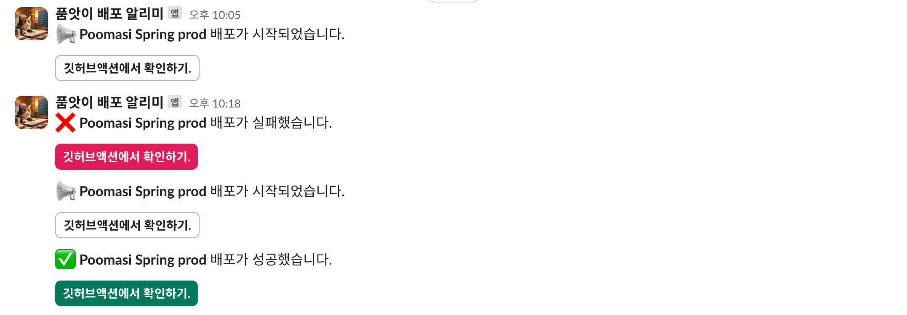

	Slack 알림: 빌드 및 배포 상태는 Slack 채널로 알림이 전송되며, 성공 및 실패 여부에 따라 적절한 알림 메시지가 전송됩니다. 이를 통해 실시간으로 배포 상태를 파악할 수 있습니다.

## 👥 Collaborators

<h3 align="center"> Backend</h3>
<div align="center">
<table align="center">
  <tr>
    <td align="center" width="200px">
      <a href="https://github.com/amm0124" target="_blank">
        
      </a>
    </td>
    <td align="center" width="200px">
      <a href="https://github.com/canyos" target="_blank">
        
      </a>
    </td>
    <td align="center" width="200px">
      <a href="https://github.com/stopmin" target="_blank">
        
      </a>
    </td>
    <td align="center" width="200px">
      <a href="https://github.com/jjt4515" target="_blank">
        
      </a>
    </td>
  </tr>
  <tr>
    <td align="center">
      <a href="https://github.com/amm0124" target="_blank">김건호</a>
    </td>
    <td align="center">
      <a href="https://github.com/canyos" target="_blank">이풍헌</a>
    </td>
    <td align="center">
      <a href="https://github.com/stopmin" target="_blank">정지민</a>
    </td>
    <td align="center">
      <a href="https://github.com/jjt4515" target="_blank">정진택</a>
    </td>
  </tr>
</table>
</div>
<h3 align="center"> FrontEnd</h3>

<div align="center">
<table align="center">
  <tr>
    <td align="center" width="200px">
      <a href="https://github.com/jasper200207" target="_blank">
        
      </a>
    </td>
    <td align="center" width="200px">
      <a href="https://github.com/rudtj" target="_blank">
        
      </a>
    </td>
  </tr>
  <tr>
    <td align="center">
      <a href="https://github.com/amm0124" target="_blank">김도균</a>
    </td>
    <td align="center">
      <a href="https://github.com/canyos" target="_blank">이경서</a>
    </td>
  </tr>
</table>
</div>
